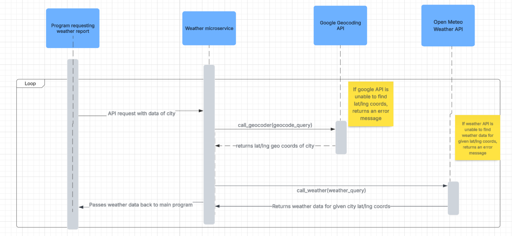
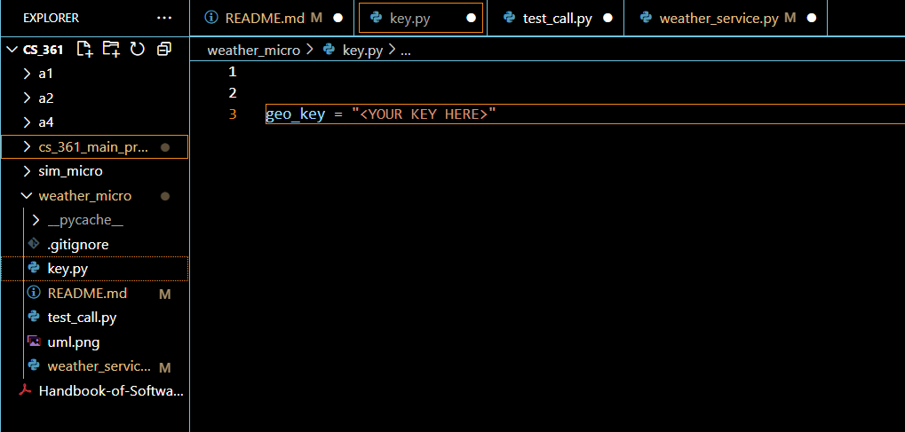
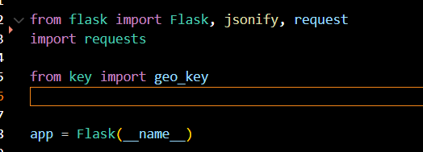

# weather_micro

## UML

## How to Use

While the microservice is running, all you need to do is add your city search parameters to the base API query string 

"http://127.0.0.1:8001/fetch-weather?"

Append your search parameters in the form 

"city={CITY NAME HERE}&state={STATE NAME HERE}&country={COUNTRY NAME HERE}&zipcode={ZIPCODE HERE}"

All spaces in city, state, country, and zipcode string parameters should be replaced with "+" before being passed to the weather microservice.
You may use full names or abbreviations for state and country names.

It is not required to uitilize all search parameters, and empty strings may be passed in, however the more parameters are filled in the more 
precise the geocodes will be. Google's geocoding API will be able to infer some things, but it may return data for Portland, Oregon when you meant 
to get data for Portland, Maine if you do not provide a state or zipcode to narrow down the search.

The data will be returned as JSON, so if you are looking to view the returned data in console for testing, it is reccomended you use JSON pretty 
print for easier console viewing, like the example below

`
pretty_print = json.dumps(weather_results_by_city, indent=4)
`

An example call can be made with a simple function which accepts your query string, such as

`def call_weather_microservie(sim_request_string):`

    `response = requests.get(sim_request_string)`
    `return response.json().get("results")`
`city = las+vegas`
`state = nv`
`country = united+states`
`zipcode = ""`
`custom_query = f"city={city}&state={state}&country={country}&zipcode={zipcode}"`
`query_string = weather_microservice_url + custom_query`
`weather_results_by_city = call_weather_microservie(query_string)`

The above code will return data for Las Vegas, Nevada. You could also remove the empty parameters from the query string and change the inputs to

`
city = las+vegas
state = nevada

custom_query = f"city={city}&state={state}"
query_string = weather_microservice_url + custom_query
weather_results_by_city = call_weather_microservie(query_string)
`

And it will still be able to infer Las Vegas, Nevada.

## Mitigation Plan

This microservice was created for Benjamin Joseph

The current state is complete, unless code review requires any minor tweaks 

This code can be accessed by git cloning this repository and running locally

I have already shared the repo link over Teams and am in direct contact if any issues come up

## Additional consideration

The only additional consideration is the Google API key, which can be set up [here](https://developers.google.com/maps/documentation/geolocation/cloud-setup)

Billing will need to be enabled for the API key to work, but the first 10k requests per month are free, and budgets can be set up so you are not 
accidentally charged [info](https://cloud.google.com/billing/docs/how-to/budget-api)

Once the API key has been created and billing enabled, you will need to create a "key.py" file in the main directory 

They gitignore is already set to ignore any key.py file, so it is highly reccomended you use that file name to avoid accidentially pushing your 
API key to the repo.

The needed libraries are shown below, along with the import of "geo_key" from key as shown above

